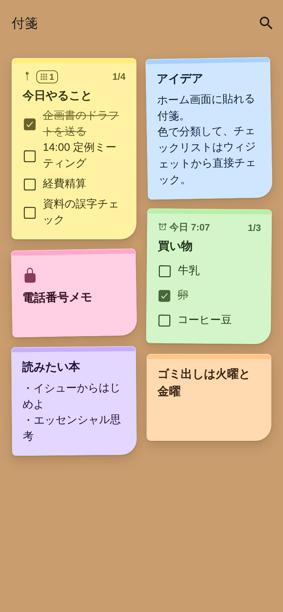
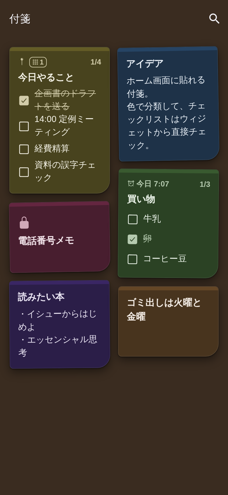
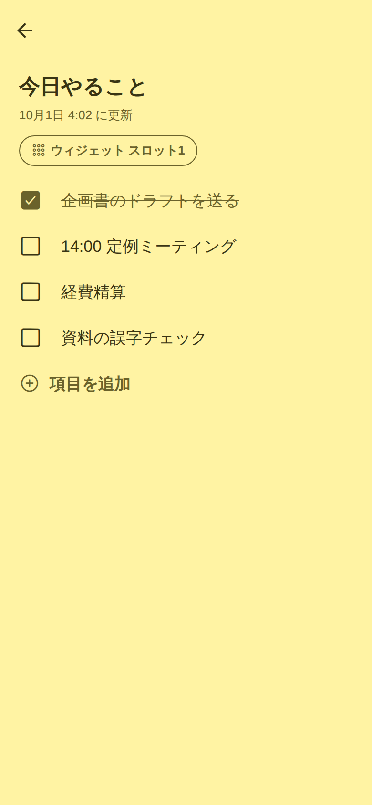
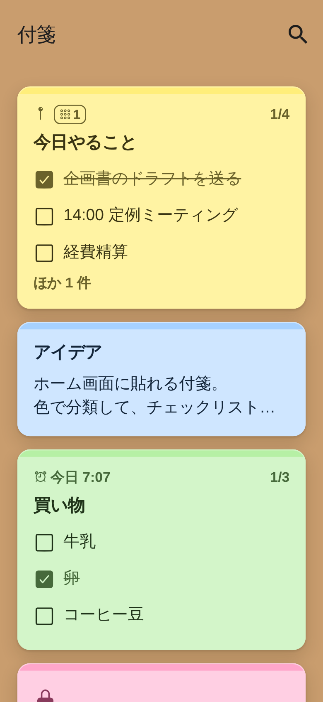
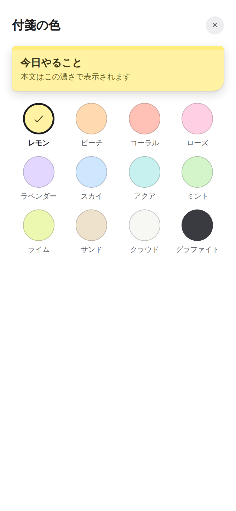
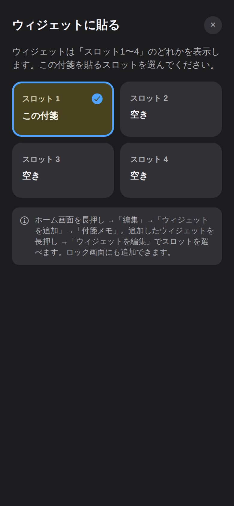
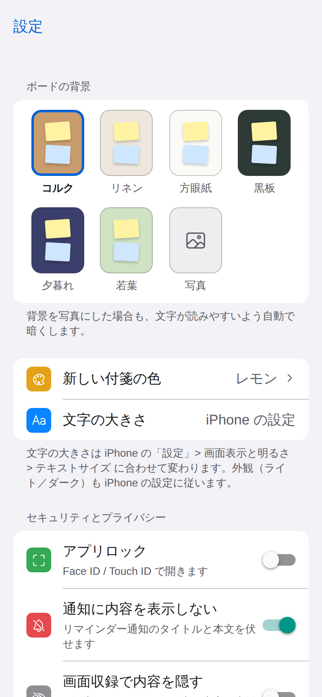
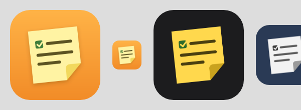

# 付箋メモ（sticky-memo）

ホーム画面・ロック画面にウィジェットとして貼れる、**iPhone 専用**の付箋メモアプリ。データは iPhone の中だけに暗号化して保存します。
Expo SDK 57 / React Native 0.86 / iOS 17 以降。

| ボード | ダークモード | 編集 | 文字を大きくしたとき |
| --- | --- | --- | --- |
|  |  |  |  |

| 色の選択 | ウィジェットに貼る | 設定 | アプリアイコン（ライト／ダーク／色合い） |
| --- | --- | --- | --- |
|  |  |  |  |

> スクリーンショットはデザイン確認用の Web プレビューで撮影したものです。iPhone では、上部のナビゲーションバー・検索欄・ボタン・下部ツールバー・長押しメニュー・日付ピッカーが iOS 標準の部品で表示されます（Web では表示されません）。

## 見やすさの設計（Apple Human Interface Guidelines 準拠）

基準は Apple の Human Interface Guidelines（以下 HIG。Typography / Accessibility / Dark Mode / Widgets / App icons、2026-10-01 取得）です。数値で決められる項目は、テストで自動検証しています。

| 観点 | HIG の基準 | このアプリでの対応 | 検証 |
| --- | --- | --- | --- |
| 文字のコントラスト | 17pt 以下は 4.5:1 以上、18pt 以上・太字は 3:1 以上 | 本文は 7:1 以上、補足文字（日時・件数・チェック済み）も 4.5:1 以上に調整。iOS 標準の補助文字色（約 3.4:1）より濃くしています | `tests/palette.test.ts`（12色 × ライト／ダーク、UI 色、背景上の見出し） |
| 文字の大きさ | 既定 17pt、最小 11pt。細いウェイトを避ける | iOS 標準テキストスタイル（本文 17pt）を採用。最小は 11pt。日本語は行間を約 1.5 倍に | コードレビュー＋ウィジェットはテストで固定サイズの小さい文字がないことを確認 |
| Dynamic Type | システムの文字サイズ設定に従う | アプリ独自の文字サイズ設定を廃止し、iPhone の「テキストサイズ」に追従。文字が大きいときや狭い画面では付箋ボードを自動で1列にして切り詰めを減らす | Web プレビューで1列表示を確認 |
| ダークモード | システムの外観に従い、アプリ独自の切り替えを置かない | 12色それぞれに暗い紙色を用意（反転ではなく同じ色相の沈んだ色）。背景6種もダーク版あり | コントラストはテストで検証 |
| タップ領域 | 44×44pt 以上 | すべてのボタン・チェックボックス・行を 44pt 以上に。付箋上のチェック行は 34pt＋上下余白で 44pt | — |
| 色だけに頼らない | 色覚の違いに配慮 | 色の選択肢には必ず色名を表示。状態はアイコン（チェック・鍵・ピン）でも表示 | — |
| アクセシビリティ設定 | コントラストを上げる・文字を太くする | 「コントラストを上げる」がオンなら補足文字も本文色にし、付箋の傾きをなくす。「文字を太くする」がオンなら1段太く。「視差効果を減らす」で押下時の縮小アニメーションを止める | — |
| VoiceOver | 内容を読み上げで伝える | 付箋は「色・タイトル・進捗・リマインダー・ピン留め」をまとめて読み上げ。チェックボックスは状態付きで読み上げ | — |
| 写真の背景 | 写真の上の文字も読めること | 写真には最低 50% の暗幕をかけ、真っ白な写真でも白い大見出しが 3:1 以上になるようにしています | — |
| ウィジェット | 11pt 以上、標準の 16pt 余白、システムフォント、ライト／ダーク対応 | テキストスタイル指定で Dynamic Type に追従、チェック行は 30pt 以上、iPhone の外観に合わせて紙色を切り替え | `tests/iosWidget.test.ts` |

## iPhone アプリとしての作り

- **iOS 標準の部品を使用**：大見出しのナビゲーションバー、標準の検索欄、SF Symbols のアイコン、ヘッダーのメニュー（表示・並べ替え・色で絞り込み）、下部ツールバー（「メモ」アプリと同じく左にチェックリスト、右に新規作成）、下から出るシート、標準のカレンダー＋時刻ピッカー、付箋を長押ししたときのプレビューとメニュー、ゴミ箱のアクションシート
- **iOS の外観とアイコン**：ライト／ダークの自動切り替え、iOS 18 のダーク・色合い（ティント）アイコン、起動画面
- **対象**：iPhone 専用（iPad 非対応）、iOS 17 以降（ウィジェットのボタン操作と設定に iOS 17 が必要なため）
- iOS 26 以降では、ナビゲーションバーとツールバーが自動的に Liquid Glass のデザインになります

## 手本にした実在アプリと対応表

| 手本アプリ | 公開情報から確認した仕様 | 本アプリでの実装 |
| --- | --- | --- |
| **Stibo**（iOS、累計150万人とされる付箋アプリ） | 付箋の色12種類 | 12色（レモン〜グラファイト） |
| | 背景画像6種類 | 背景プリセット6種（コルク／リネン／方眼紙／黒板／夕暮れ／若葉）＋端末内の写真 |
| | ホーム画面・ロック画面ウィジェット | iOS: ホーム（小・中・大）＋ロック画面（長方形・インライン・円形） |
| | アラーム・タイマー | リマインダー（10分後〜明日9時のクイック設定＋日時指定）。端末内ローカル通知 |
| **ColorNote**（Android の定番メモ） | テキスト／チェックリストの2形式 | 同じ2形式。相互変換あり（1行＝1項目） |
| | チェックで取り消し線、全項目チェックでタイトルにも取り消し線 | 同じ挙動 |
| | 編集時に上下ボタンで項目を並べ替え | 同じ（↑↓ボタン） |
| | 色で整理 | 色で絞り込み（複数選択）・色順ソート |
| | パスワードロック | 付箋ごとのロック＋アプリ全体ロック（Face ID／パスコードを使用） |
| | 付箋ウィジェット | iPhone のホーム画面ウィジェット。チェックリストはウィジェット上でチェック可能 |

その他：ピン留め（先頭固定）、検索、並べ替え（更新・作成・色・タイトル・リマインダー）、ボード表示（2列）／リスト表示、ゴミ箱（30日後に自動削除）。

## ウィジェットの仕組み

アプリで付箋を開き、下部ツールバーの「ウィジェット」ボタン（または付箋の長押しメニュー）から **スロット1〜4** に貼ると、そのスロットを表示しているウィジェットに出ます。

- ホーム画面（小・中・大）とロック画面（長方形・インライン・円形）に対応
- ウィジェットを長押し →「ウィジェットを編集」でスロットを選択
- チェックリストはウィジェット上のボタンでチェックでき、アプリを開いたときにアプリ側へ取り込みます（アプリ側で後から編集していた場合はアプリ側を優先）

## セキュリティ・プライバシー設計

| 項目 | 内容 |
| --- | --- |
| 保存先 | iPhone の中だけ。SQLCipher で暗号化した SQLite（`expo-sqlite` の `useSQLCipher`） |
| 暗号鍵 | 初回起動時に端末内で乱数生成（32バイト）し、キーチェーンに `WHEN_UNLOCKED_THIS_DEVICE_ONLY` で保存。バックアップ経由で他の端末に移りません |
| 通信 | なし（アカウント・クラウド同期・解析 SDK なし） |
| ロック | アプリロック（自動ロックまで：すぐ／1分／5分／15分）と付箋ごとのロック。認証は Face ID・パスコードに任せ、アプリ独自のパスワードは保存しない |
| ウィジェット | ロック中の付箋は中身を一切渡さず、鍵アイコンのみ表示 |
| 通知 | 既定で「通知に内容を表示しない」。ロック中の付箋は常に伏せる |
| 画面 | アプリ切替画面では内容を隠す（ロックまたは収録防止がオンのとき）。設定で画面収録・ミラーリング中に内容を隠せる（`expo-screen-capture`） |

**注意点（残るリスク）**

- ウィジェットに表示した内容は、仕組み上アプリの暗号化 DB の外（App Group の共有領域）に置かれ、ホーム画面・ロック画面で誰でも見られます。見られたくない付箋はロックするか、ウィジェットに貼らないでください。
- 背景に選んだ写真はアプリ内にコピーしますが、DB とは別ファイルのため暗号化されません（iOS 標準のファイル保護のみ）。
- iCloud／PC にバックアップした場合、暗号化 DB ファイル自体はバックアップに含まれ得ます。鍵は端末外に出ないため別の端末では復号できません（＝機種変更時にデータは引き継がれません）。データ移行機能は未実装です。

## 開発・ビルド

Node.js 22 以上。ネイティブ機能（ウィジェット・SQLCipher・Face ID・iOS 標準ツールバー）を使うため **Expo Go では動きません**。開発ビルドが必要です。

```sh
cd sticky-memo
npm ci

# 開発ビルド（クラウド。Mac がなくても可）
npx eas-cli@latest build --profile development --platform ios
npx expo start --dev-client

# Mac でローカルにビルドする場合（Xcode が必要）
npx expo run:ios

# 本番ビルド
npx eas-cli@latest build --profile production --platform ios
```

ウィジェット拡張は App Group `group.com.kouritsuapps.stickymemo` を使います（`expo-widgets` が自動設定）。`bundleIdentifier`（`com.kouritsuapps.stickymemo`）は公開前にご自身のものへ変更してください。

### チェック

```sh
npm run typecheck   # TypeScript（アプリ＋テスト）
npm run lint        # ESLint（eslint-config-expo）
npm test            # 単体テスト（node:test）：ロジック・コントラスト比・ウィジェット
```

### Web プレビュー（デザイン確認用）

`npm run preview:web` でブラウザに表示できます。サンプルデータをメモリに置くだけで、保存・通知・ウィジェット・ロック、iOS 標準のツールバーやメニューは動きません（`*.web.ts(x)` が代わりを担当）。製品は iPhone 専用です。

## 構成

```
src/
  app/                 画面（Expo Router）: ボード / 編集 / 設定 / ゴミ箱 / シート（色・リマインダー・ウィジェット）
  components/          付箋カード・iOS 風リスト部品・テーマ（文字・色・アクセシビリティ設定）
  domain/              純粋ロジック（並べ替え・チェックリスト・配色・ウィジェット用データ）
  storage/             暗号化 DB・背景写真
  security/            Face ID / パスコード認証
  state/               ストア（状態・保存・ウィジェット同期）、リマインダー
  widgets/ios/         ウィジェット（expo-widgets）
tests/                 単体テスト
```

## 技術選定と制約

| 選定 | 理由 | 制約・リスク |
| --- | --- | --- |
| Expo SDK 57 + Expo Router | EAS でクラウドビルドでき、Mac がなくても iPhone アプリを作れる | ネイティブ部分は自動生成（`ios/` は手で編集しない） |
| `Stack.Toolbar` / `Link.Preview`・`Link.Menu`（Expo Router） | iOS 標準のツールバー・メニュー・長押しプレビューをそのまま使える | **アルファ版の API**（Stack.Toolbar）。今後の SDK で書き方が変わる可能性があります |
| `expo-symbols` | SF Symbols で文字と揃うアイコン | ベータ版 |
| `@expo/ui`（SwiftUI の DatePicker） | iOS 標準のカレンダー＋時刻ピッカー | — |
| `expo-widgets` | SDK 56 で安定版。ウィジェットを React で書け、ボタン操作もアプリ起動なしで反映 | ウィジェット関数内は外部の変数・フック・非同期処理を使えない。**文字列化の際に `'\n'` などのエスケープが失われる**ため使わない（テストで検出済み） |
| `expo-sqlite` + SQLCipher | 公式モジュールで DB 全体を暗号化 | App Store の暗号化（輸出規制）に関する質問への回答が必要になる場合があります。公開前にご確認ください |

## 出典（2026-10-01 取得）

アプリストアと一部の紹介サイトはこの開発環境のネットワーク制限で直接開けなかったため、手本アプリの仕様は **Web 検索結果の要約** から確認しています（実機で触って確認したものではありません）。ライブラリ仕様は公式ドキュメント原稿と、インストールしたパッケージの型定義・ソースで確認しました。

手本アプリ（検索結果の要約から確認）
- Stibo — App Store: https://apps.apple.com/jp/app/stibo-su-zaokumemoreru-fu/id859111681 〔公式ストア〕
- Stibo の機能紹介（12色・背景画像6種・アラーム・ロック画面ウィジェット）: https://app-liv.jp/1423061/ 〔非公式・アプリ紹介サイト〕
- ColorNote — Google Play: https://play.google.com/store/apps/details?id=com.socialnmobile.dictapps.notepad.color.note 〔公式ストア〕
- ColorNote の機能説明（2形式・取り消し線・並べ替え・パスワードロック・付箋ウィジェット）: https://colornote.en.softonic.com/android 〔非公式・ソフト紹介サイト〕

デザイン基準（直接確認）
- Apple Human Interface Guidelines — Typography: https://developer.apple.com/design/human-interface-guidelines/typography 〔公式〕
- 同 Accessibility（コントラスト比・最小タップ領域）: https://developer.apple.com/design/human-interface-guidelines/accessibility 〔公式〕
- 同 Dark Mode: https://developer.apple.com/design/human-interface-guidelines/dark-mode 〔公式〕
- 同 Widgets: https://developer.apple.com/design/human-interface-guidelines/widgets 〔公式〕

ライブラリ（直接確認）
- Expo Widgets（SDK 57 ドキュメント原稿）: https://github.com/expo/expo/blob/main/docs/pages/versions/v57.0.0/sdk/widgets.mdx 〔公式〕
- Expo SQLite / SQLCipher（SDK 57）: https://github.com/expo/expo/blob/main/docs/pages/versions/v57.0.0/sdk/sqlite.mdx 〔公式〕
- Expo Router: Stack Toolbar / Link preview / Modals（formSheet）/ Stack: https://github.com/expo/expo/tree/main/docs/pages/router 〔公式〕
- Expo Symbols / Expo UI DatePicker / Splash screen and app icon（SDK 57）: https://github.com/expo/expo/tree/main/docs/pages/versions/v57.0.0/sdk 〔公式〕
- 「iOS widgets and Live Activities are stable in Expo SDK 56」: https://expo.dev/blog/ios-widgets-and-live-activities-in-expo 〔公式ブログ／検索結果の要約のみ〕
