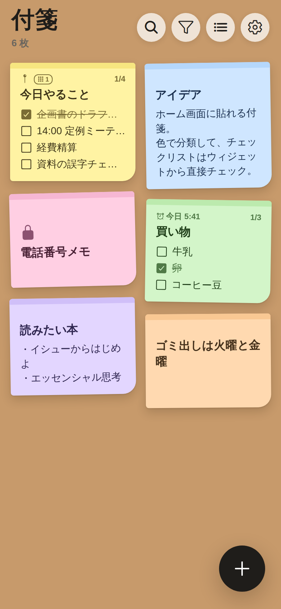
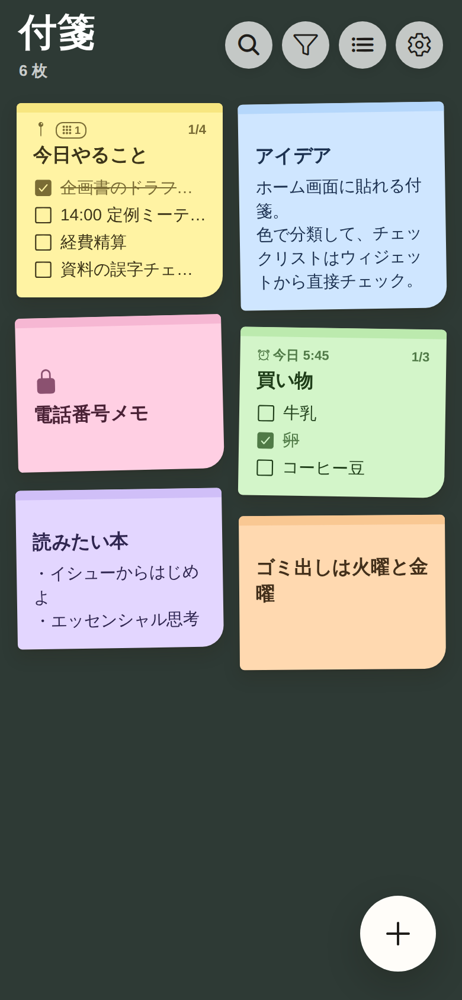
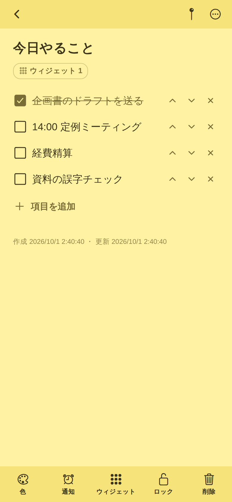
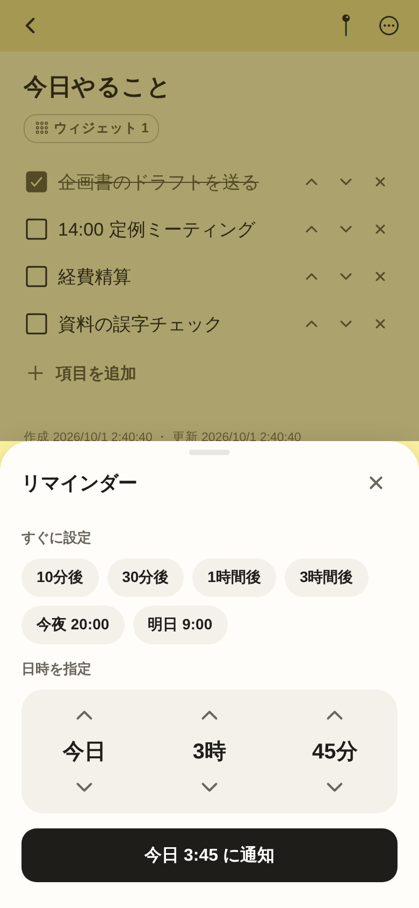

# 付箋メモ（sticky-memo）

ホーム画面・ロック画面にウィジェットとして貼れる、端末内完結の付箋メモアプリ（iOS / Android）。
Expo SDK 57 / React Native 0.86 で作られています。

| ボード（コルク） | ボード（黒板） | 編集 | リマインダー |
| --- | --- | --- | --- |
|  |  |  |  |

> スクリーンショットは Web プレビュー（デザイン確認用）で撮影したものです。実機の見た目とは細部（フォント・影など）が異なります。

## 手本にした実在アプリと対応表

| 手本アプリ | 公開情報から確認した仕様 | 本アプリでの実装 |
| --- | --- | --- |
| **Stibo**（iOS、累計150万人とされる付箋アプリ） | 付箋の色12種類 | 12色（レモン〜グラファイト） |
| | 背景画像6種類 | 背景プリセット6種（コルク／リネン／方眼紙／黒板／夕暮れ／若葉）＋端末内の写真 |
| | ホーム画面・ロック画面ウィジェット | iOS: ホーム（小・中・大）＋ロック画面（長方形・インライン・円形） |
| | アラーム・タイマー | リマインダー（10分後〜明日9時のクイック設定＋日時指定）。端末内ローカル通知 |
| **ColorNote**（Android の定番メモ） | テキスト／チェックリストの2形式 | 同じ2形式。相互変換あり（1行＝1項目） |
| | チェックで取り消し線、全項目チェックでタイトルにも取り消し線 | 同じ挙動 |
| | 編集時に上下ボタンで項目を並べ替え | 同じ（↑↓ボタン） |
| | 色で整理 | 色で絞り込み（複数選択）・色順ソート |
| | パスワードロック | 付箋ごとのロック＋アプリ全体ロック（端末の生体認証／パスコードを使用） |
| | 付箋ウィジェット | Android ホーム画面ウィジェット。チェックリストはウィジェット上でチェック可能 |

その他：ピン留め（先頭固定）、検索、並べ替え（更新・作成・色・タイトル・リマインダー）、ボード表示（2列）／リスト表示、文字サイズ3段階、ゴミ箱（30日後に自動削除）。

## ウィジェットの仕組み

アプリで付箋を開き、下部の「ウィジェット」から **スロット1〜4** に貼ると、そのスロットを表示しているウィジェットに出ます。

- **iOS**：ウィジェットを長押し →「ウィジェットを編集」でスロットを選択（iOS 17 以降）。チェックリストはウィジェット上のボタンでチェックでき、アプリを開いたときにアプリ側へ取り込みます（アプリ側で後から編集していた場合はアプリ側を優先）。
- **Android**：ウィジェットのヘッダー（⇄）をタップするとスロットを切り替え。項目のタップでチェックが切り替わり、端末内 DB に直接保存されます。アプリの設定画面からホーム画面への追加ダイアログも出せます。

## セキュリティ・プライバシー設計

| 項目 | 内容 |
| --- | --- |
| 保存先 | 端末内のみ。SQLCipher で暗号化した SQLite（`expo-sqlite` の `useSQLCipher`） |
| 暗号鍵 | 初回起動時に端末内で乱数生成（32バイト）し、iOS Keychain / Android Keystore（`expo-secure-store`）に保存。iOS は `WHEN_UNLOCKED_THIS_DEVICE_ONLY` で、バックアップ経由で他端末に移らない |
| 通信 | なし（アカウント・クラウド同期・解析 SDK なし）。本番ビルドでは Android の `INTERNET` 権限を外す（`app.config.ts`） |
| バックアップ | Android `allowBackup=false` |
| ロック | アプリロック（自動ロックまでの時間：すぐ／1分／5分／15分）と付箋ごとのロック。認証は端末の Face ID・指紋・パスコードに任せ、アプリ独自のパスワードは保存しない |
| ウィジェット | ロック中の付箋は中身を一切渡さず、鍵アイコンのみ表示 |
| 通知 | 既定で「通知に内容を表示しない」。ロック中の付箋は常に伏せる |
| 画面 | アプリ切替画面では内容を隠す（ロックまたは撮影防止がオンのとき）。設定でスクリーンショット・画面収録の防止（`expo-screen-capture`） |

**注意点（残るリスク）**

- ウィジェットに表示した内容は、仕組み上アプリの暗号化 DB の外（iOS は App Group の共有領域、Android はランチャー）に置かれ、ホーム画面・ロック画面で誰でも見られます。見られたくない付箋はロックするか、ウィジェットに貼らないでください。
- 背景に選んだ写真はアプリ内にコピーしますが、DB とは別ファイルのため暗号化されません（OS 標準のファイル保護のみ）。
- iOS 端末を iCloud／PC にバックアップした場合、暗号化 DB ファイル自体はバックアップに含まれ得ます。鍵は端末外に出ないため、別端末で復号はできません（＝機種変更時にデータは引き継がれません）。データ移行機能は未実装です。

## 開発・ビルド

Node.js 22 以上。ネイティブ機能（ウィジェット・SQLCipher・生体認証）を使うため **Expo Go では動きません**。開発ビルドが必要です。

```sh
cd sticky-memo
npm ci

# 開発ビルド（クラウド）
npx eas-cli@latest build --profile development --platform ios     # または android
npx expo start --dev-client

# ローカルでビルドする場合（Xcode / Android Studio が必要）
npx expo run:ios
npx expo run:android

# 本番ビルド（Android の INTERNET 権限が外れる）
npx eas-cli@latest build --profile production --platform all
```

iOS のウィジェット拡張は App Group `group.com.kouritsuapps.stickymemo` を使います（`expo-widgets` が自動設定）。Apple Developer の App ID / App Group は署名時に作成されます。`bundleIdentifier` / `package`（`com.kouritsuapps.stickymemo`）は公開前にご自身のものへ変更してください。

### チェック

```sh
npm run typecheck   # TypeScript（アプリ＋テスト）
npm run lint        # ESLint（eslint-config-expo）
npm test            # 単体テスト（node:test）
```

テストには、iOS ウィジェットを Expo の Babel 設定で実際に文字列化し、スタブ環境で評価して「描画内容」「ボタン押下で props が更新されること」を確認するものが含まれます。

### Web プレビュー

`npx expo start --web` でデザイン確認用のプレビューが開きます。Web 版はサンプルデータをメモリに置くだけで、保存・通知・ウィジェット・ロックは動きません（`*.web.ts` が代替）。

## 構成

```
src/
  app/                 画面（Expo Router）: ボード / 編集 / 設定 / ゴミ箱
  components/          付箋カード・シート・共通 UI
  domain/              純粋ロジック（並べ替え・チェックリスト・ウィジェット用データ）
  storage/             暗号化 DB・背景写真
  security/            生体認証
  state/               ストア（状態・保存・ウィジェット同期）、リマインダー
  widgets/ios/         iOS ウィジェット（expo-widgets）
  widgets/android/     Android ウィジェット（react-native-android-widget）
tests/                 単体テスト
```

## 技術選定と制約

| 選定 | 理由 | 制約・リスク |
| --- | --- | --- |
| Expo SDK 57 | iOS / Android を1つのコードで。EAS でクラウドビルド可 | ネイティブ部分は CNG（`ios/` `android/` は自動生成。手で編集しない） |
| `expo-widgets`（iOS） | SDK 56 で安定版。ウィジェットを React で書け、ボタン操作もアプリ起動なしで反映 | ウィジェット関数内は外部の変数・フック・非同期処理を使えない。**文字列化の際に `'\n'` などのバックスラッシュエスケープが失われる**ため、ウィジェット内では使わない（テストで検出済み） |
| `react-native-android-widget` | Expo の config plugin 対応、クリック処理をヘッドレス JS で扱える | 0.x 系のサードパーティ製。描画はプリミティブのみ（取り消し線なし） |
| `expo-sqlite` + SQLCipher | 公式モジュールで DB 全体を暗号化 | 輸出規制の申告（App Store の暗号化に関する質問）への回答が必要になる場合があります。公開前にご確認ください |

## 出典（2026-10-01 取得）

アプリストアと一部の紹介サイトはこの開発環境のネットワーク制限で直接開けなかったため、手本アプリの仕様は **Web 検索結果の要約** から確認しています（実機で触って確認したものではありません）。ライブラリ仕様は公式ドキュメント原稿と、インストールしたパッケージの型定義・ソースで確認しました。

手本アプリ（検索結果の要約から確認）
- Stibo — App Store: https://apps.apple.com/jp/app/stibo-su-zaokumemoreru-fu/id859111681 〔公式ストア〕
- Stibo の機能紹介（12色・背景画像6種・アラーム・ロック画面ウィジェット）: https://app-liv.jp/1423061/ 〔非公式・アプリ紹介サイト〕
- ColorNote — Google Play: https://play.google.com/store/apps/details?id=com.socialnmobile.dictapps.notepad.color.note 〔公式ストア〕
- ColorNote の機能説明（2形式・取り消し線・並べ替え・パスワードロック・付箋ウィジェット）: https://colornote.en.softonic.com/android 〔非公式・ソフト紹介サイト〕

ライブラリ（直接確認）
- Expo Widgets（SDK 57 ドキュメント原稿）: https://github.com/expo/expo/blob/main/docs/pages/versions/v57.0.0/sdk/widgets.mdx 〔公式〕
- Expo SQLite / SQLCipher（SDK 57）: https://github.com/expo/expo/blob/main/docs/pages/versions/v57.0.0/sdk/sqlite.mdx 〔公式〕
- react-native-android-widget ドキュメント: https://github.com/sAleksovski/react-native-android-widget/tree/master/docs 〔ライブラリ公式〕
- 「iOS widgets and Live Activities are stable in Expo SDK 56」: https://expo.dev/blog/ios-widgets-and-live-activities-in-expo 〔公式ブログ／検索結果の要約のみ〕
